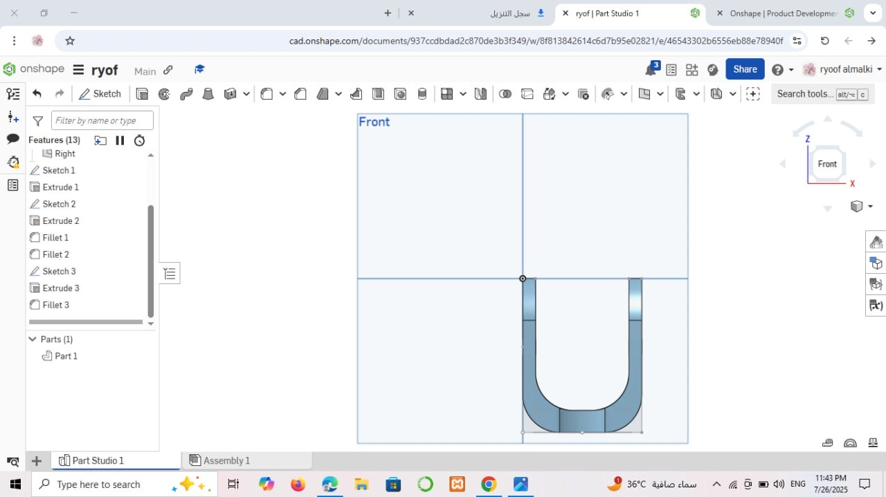
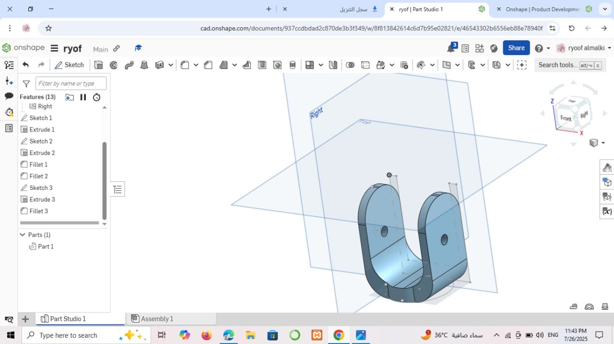
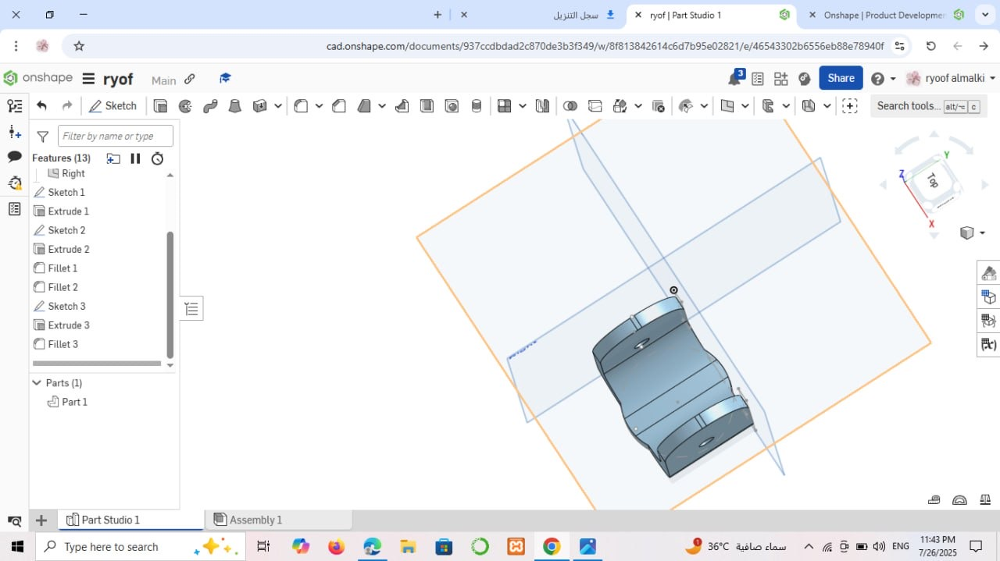

# 🪻 Enhanced Joint Design - Task2 🪻

This project involves enhancing the joint design to achieve a more efficient and durable structure.  
The model was created and optimized using Onshape, and then exported to SolidWorks for further analysis.

---

## 🪻🪷 Task Overview 🪻🪷
The goal of this task was to refine the design based on the provided reference, ensuring that the part meets the expected functional and aesthetic requirements.  
The final design can be reviewed through the attached SolidWorks file and reference images.

--- 

## 🪻🪷 Included Files 🪻🪷
- SolidWorks Model: ryoof_almalki(1).sldprt
- Images: Screenshots showing different views of the 3D model.

--- 

## 🪻🪷 Screenshots 🪻🪷
  
  
  

---

## 🪻🪷 Created By 🪻🪷
🎀 Ryoof Dukhailallah Almalki 🎀
